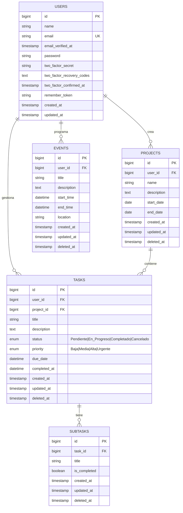

# Diagrama Entidad-Relación

## Sistema de Gestión de Tareas y Proyectos

## Descripción de Relaciones

### USERS (Usuarios)
- **1:N con PROJECTS**: Un usuario puede crear múltiples proyectos
- **1:N con TASKS**: Un usuario puede gestionar múltiples tareas
- **1:N con EVENTS**: Un usuario puede programar múltiples eventos
- **1:N con REMINDERS**: Un usuario puede configurar múltiples recordatorios

### PROJECTS (Proyectos)
- **N:1 con USERS**: Cada proyecto pertenece a un usuario
- **1:N con TASKS**: Un proyecto puede contener múltiples tareas

### TASKS (Tareas)
- **N:1 con USERS**: Cada tarea pertenece a un usuario
- **N:1 con PROJECTS**: Cada tarea puede pertenecer a un proyecto (opcional)
- **1:N con SUBTASKS**: Una tarea puede tener múltiples subtareas
- **1:N con REMINDERS**: Una tarea puede tener múltiples recordatorios

### SUBTASKS (Subtareas)
- **N:1 con TASKS**: Cada subtarea pertenece a una tarea

### EVENTS (Eventos)
- **N:1 con USERS**: Cada evento pertenece a un usuario

## Enumeraciones

### TaskStatus (Estado de Tarea)
- `Pendiente`: Tarea sin iniciar
- `En_Progreso`: Tarea en desarrollo
- `Completado`: Tarea finalizada
- `Cancelado`: Tarea cancelada

### TaskPriority (Prioridad de Tarea)
- `Baja`: Prioridad baja
- `Media`: Prioridad media
- `Alta`: Prioridad alta
- `Urgente`: Prioridad urgente

### ReminderMethod (Método de Recordatorio)
- `Email`: Notificación por correo electrónico
- `Notificacion`: Notificación push/interna
- `SMS`: Notificación por mensaje de texto

## Reglas de Negocio

1. **Soft Deletes**: Las entidades PROJECTS, TASKS, SUBTASKS y EVENTS utilizan eliminación suave (soft deletes)
2. **Autenticación**: Los usuarios utilizan Fortify para autenticación con soporte para 2FA
3. **Completado Automático**: Cuando una tarea cambia a estado "Completado", se establece automáticamente `completed_at`
4. **Alcance Global**: Todas las consultas de tareas están filtradas por el usuario autenticado
5. **Cascada**: Los recordatorios están vinculados a tareas específicas para notificaciones contextuales

## Índices y Restricciones

- **users.email**: UNIQUE (UK)
- **tasks.user_id**: INDEX + FOREIGN KEY
- **tasks.project_id**: INDEX + FOREIGN KEY (nullable)
- **subtasks.task_id**: INDEX + FOREIGN KEY
- **events.user_id**: INDEX + FOREIGN KEY
- **reminders.user_id**: INDEX + FOREIGN KEY
- **reminders.task_id**: INDEX + FOREIGN KEY (nullable)
- **projects.user_id**: INDEX + FOREIGN KEY
